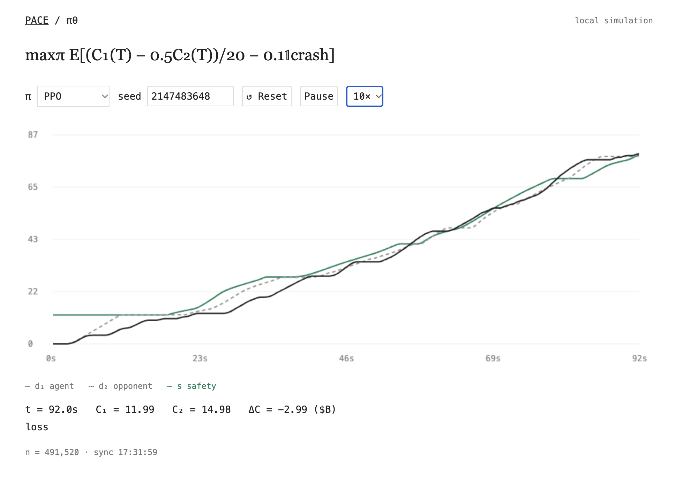

# XRiskMan: Teaching an autoregressive agent to "Pace The Frontier"



Recentely, the great venture capital firm Paradigm released an article and acompannying game, "The Game Theory of AI Pacing". It is inspired by a paper authored by Drew Fudenberg and Andrew Ko.
In one sentence, there exists k-players, each player has a choice of whether to Accelerate or not, and whether to publicize or not (the latter is removed by Paradigm's version).

Inspired by general rationalist litreture I set out to train an autoregressive agent, using a combination of imitation training and RL (PPO) to pareto-optimally navigate the P(doom) landscape. The following is a preliminary result.

## Model

Input: **[BS, 32, 16]** — the current step and 31 previous steps, each represented
by 16 numbers (Note, not a linguistic token):

| Indices | Features, in order |
|---|---|
| 0–3 | Time remaining, safety, own deployment − safety, opponent deployment − safety |
| 4–7 | Own research, speed, deployment, cash |
| 8–11 | Opponent deployment, cash, visible research, research-visible flag |
| 12–15 | Own research-on flag, own sharing, opponent sharing, own stopping distance |

## Training - Imitation
## Training - PPO

## Building

| Section | Options (default) |
|---|---|
| Environment | `dt=1/60`, `decision_dt=.1`, `duration=90`, `delay=2`, `acceleration=.62`, `deceleration=.62`, `initial_safety=12`, `safety_flat_until=18`, `safety_plateaus=true`, `max_hazard=.24` |
| Model | `context=32`, `width=64`, `heads=4`, `layers=2`, `input_dim=16` |
| Run | `steps=8388608`, `seed=0`, `out=runs/pace`, `device=auto`, `threads=4`, `envs=32` |
| Imitation | `imitation_updates=5000`, `imitation_lr=3e-4` |
| PPO | `rollout=1024`, `epochs=4`, `batch=256`, `lr=3e-4`, `adam_eps=1e-5`, `gamma=1`, `gae_lambda=1`, `clip_ratio=.2`, `value_coef=.5`, `entropy_coef=.01`, `max_grad_norm=.5`, `target_kl=.03` |
| Evaluation | `eval_episodes=128`, `eval_every=5` |
| Reward | `alpha=0`, `beta=0` |

```sh
./train_and_eval_full.py --config default.json --alpha 0.5 --beta 0.1
```
